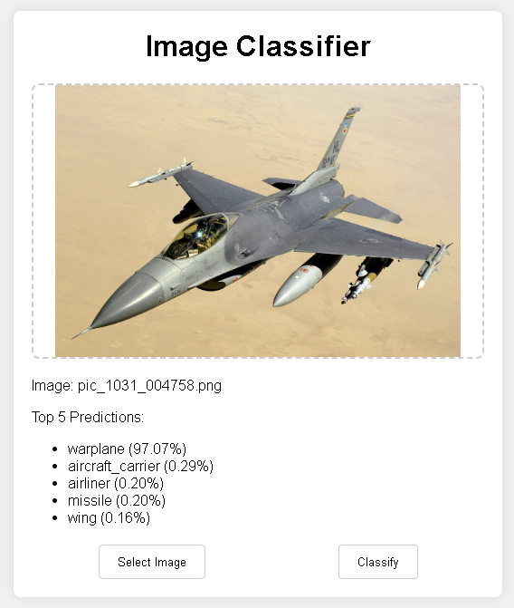
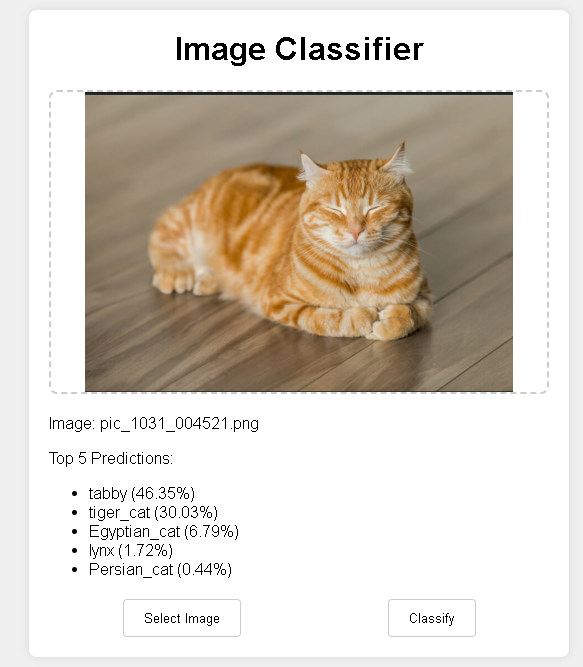
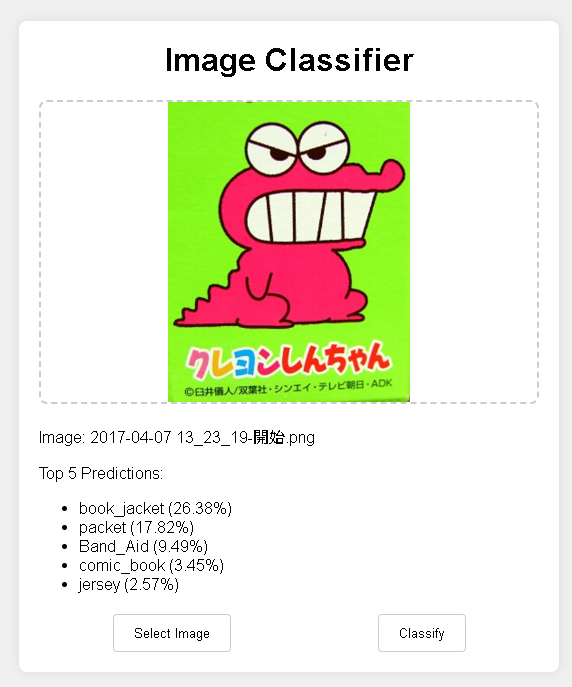

# CogniPixel: A Computer Vision Exploration

Welcome to **CogniPixel**, a curated collection of applications and tools designed to explore the fascinating world of computer vision. This repository serves as a hands-on learning journal, documenting the journey from basic concepts to more advanced implementations.

---

## Projects Collection

1.  **[Image Classifier (Flask)](#1-image-classifier-flask)**: A web-based tool for classifying images using a pre-trained deep learning model.
2.  **[Person Detector (TensorFlow.js)](#2-person-detector-tensorflowjs)**: A lightweight, serverless person detection tool running entirely in your browser. ([中文版本](#2-ai-人物偵測器-tensorflowjs))

---

## 1. Image Classifier (Flask)

A simple, self-contained web application that allows users to upload an image and receive a classification of its content based on the MobileNetV2 model.

### Demo

Here are some examples of the classifier in action:

| Input Image | Classification Result |
| :---: | :---: |
|  |  |

### Prerequisites

Before you begin, ensure you have the following installed on your system:

- **Python 3.9+**: The programming language used to run the backend server. You can download it from [python.org](https://www.python.org/downloads/).
- **Git**: The version control system used to clone the repository. You can download it from [git-scm.com](https://git-scm.com/downloads).

### How to Run

#### Option A: One-Click Start (for Windows Users)

1.  Navigate into the `CogniPixel/ImageClassifier_Flask` directory.
2.  Simply **double-click the `start.bat` file**.
3.  A command prompt window will appear, automatically install the necessary libraries, and then launch the application. A browser tab will open automatically.

#### Option B: Manual Start (for macOS, Linux, and Advanced Users)

1.  **Clone the Repository**: First, get the entire `CogniPixel` project collection on your local machine.
    ```bash
    git clone https://github.com/YourUsername/CogniPixel.git
    ```
    *(Remember to replace `YourUsername` with your actual GitHub username)*

2.  **Navigate to Project Directory**: Move into the specific folder for this tool.
    ```bash
    cd CogniPixel/ImageClassifier_Flask
    ```

3.  **Install Dependencies**: Set up a virtual environment (optional but recommended) and install the required Python packages.
    ```bash
    # Create and activate a virtual environment (optional)
    python -m venv venv
    # On Windows
    .\venv\Scripts\activate
    # On macOS/Linux
    # source venv/bin/activate

    # Install packages
    pip install -r requirements.txt
    ```

4.  **Run the Application**: Execute the Python script to start the backend server. It will automatically open the web interface in your default browser.
    ```bash
    python app.py
    ```

### Educational Significance & AI Limitations

This tool is not just a utility; it's a practical lesson in how modern AI applications are built and the inherent limitations they possess.

#### Key Learning Points:

*   **Full-Stack Interaction**: It demonstrates a complete workflow between a user-facing **frontend** (the HTML/JS/CSS webpage) and a powerful **backend** (the Python/Flask server).
*   **API Communication**: You can observe how JavaScript uses the `fetch` API to send data (the image) to a specific endpoint (`/classify`) and asynchronously receive a structured response (the JSON results).
*   **Power of Pre-trained Models**: We are leveraging **MobileNetV2**, a massive model trained by Google on millions of images. This project shows how you can integrate state-of-the-art AI into your own applications without the immense cost and time of training from scratch.

#### Understanding AI's Boundaries

An intelligent machine is not an all-knowing one. The following examples illustrate the boundaries of our AI model:

**1. Lack of Specific / Proper Noun Knowledge**

The model is trained to recognize general categories, not specific, branded, or named entities.

*   **Example**: When given an image of a famous dinosaur character from a cookie box, the AI will not recognize it as "the cookie dinosaur."
*   **AI's View**: It will correctly identify the general shape and classify it as a `tyrannosaurus_rex` or a similar generic term. It has no concept of brands, characters, or popular culture.

| Input: A specific character | AI's Interpretation: A generic object |
| :---: | :---: |
|  | `Prediction: tyrannosaurus_rex` |

**2. The Domain Gap: Real World vs. Stylized Art**

The model was primarily trained on real-world photographs. It struggles when presented with art styles that deviate significantly from reality.

*   **Example**: When shown a close-up of an anime character's face, the model may fail to provide a confident or accurate classification.
*   **AI's View**: It might identify abstract features like `hair`, `face`, or `person`, but it lacks the context to understand the artistic style. It may misinterpret large anime eyes or stylized hair, leading to strange predictions. It certainly won't know the character's name.

| Input: Stylized anime art | AI's Interpretation: A confused guess based on real-world objects |
| :---: | :---: |
|  | `Prediction: wig, mask, or other visual similarities` |

By understanding these limitations, we learn to be better engineers: we learn to choose the right model for the right task and to be critical of the results AI produces.

---

## 2. AI 人物偵測器 (TensorFlow.js)

### [English Version](#2-person-detector-tensorflowjs)
### [LIVE DEMO HERE](person-detector/index.html)


### 專案簡介

這是一個完全在使用者瀏覽器中運行的輕量級 AI 人物偵測工具。它不需要任何後端伺服器，只需一個 `index.html` 檔案即可運作。

此專案的核心功能是利用 [TensorFlow.js](https://www.tensorflow.org/js) 和預訓練的 COCO-SSD 模型，對使用者上傳的圖片進行即時分析，標示出圖片中的所有人物，並特別高亮顯示視覺上最主要（距離最近，即邊界框面積最大）的人物。

這個專案可以作為一個有趣的範例，展示如何賦予 AI 或其他自動化程式一雙簡單的「眼睛」，讓它們能夠感知環境中是否有人，並作出相應的互動，例如在偵測到人時觸發一個打招呼的動作。

### 功能特色

*   **純客戶端運行：** 無需伺服器，保護使用者隱私。
*   **單檔案部署：** 所有程式碼都在一個 `index.html` 檔案中，極其輕便。
*   **多人物偵測：** 可同時識別並框出圖片中的多個人物。
*   **主要人物高亮：** 自動計算並高亮標示畫面中最主要的人物。
*   **支援拖放與點擊上傳：** 提供友善的使用者體驗。

### 如何使用

這個專案的使用方法非常簡單：

1.  **[點擊此處進行線上體驗](person-detector/index.html)**
2.  或者，下載專案中的 `person-detector/index.html` 檔案。
3.  直接在您的網頁瀏覽器（如 Chrome, Firefox, Edge）中打開這個檔案。
4.  點擊「選擇圖片」按鈕或將圖片拖放到指定區域即可開始偵測。

---

## 2. Person Detector (TensorFlow.js)

### [中文版本](#2-ai-人物偵測器-tensorflowjs) 
### [LIVE DEMO HERE](person-detector/index.html)


### Introduction

This is a lightweight AI person detection tool that runs entirely in the user's browser. It requires no backend server and works with a single `index.html` file.

The core function of this project is to use [TensorFlow.js](https://www.tensorflow.org/js) and the pre-trained COCO-SSD model to perform real-time analysis on user-uploaded images. It identifies all individuals in the image, draws bounding boxes around them, and specifically highlights the main person (visually closest, i.e., the one with the largest bounding box area).

This project serves as an interesting example of how to give an AI or other automated programs a simple pair of "eyes," enabling them to perceive if a person is present and react accordingly, such as triggering a greeting action upon detection.

### Features

*   **Purely Client-Side:** No server required, ensuring user privacy.
*   **Single-File Deployment:** All code is contained within a single `index.html` file, making it extremely portable.
*   **Multi-Person Detection:** Capable of identifying and boxing multiple people in an image simultaneously.
*   **Main Person Highlight:** Automatically calculates and highlights the most prominent person in the frame.
*   **Drag-and-Drop & Click-to-Upload:** Provides a user-friendly experience.

### How to Use

Using this project is incredibly simple:

1.  **[Click here for a live demo](person-detector/index.html)**
2.  Alternatively, download the `person-detector/index.html` file from this repository.
3.  Open the file directly in your web browser (e.g., Chrome, Firefox, Edge).
4.  Click the "Select Image" button or drag and drop an image onto the designated area to start detection.