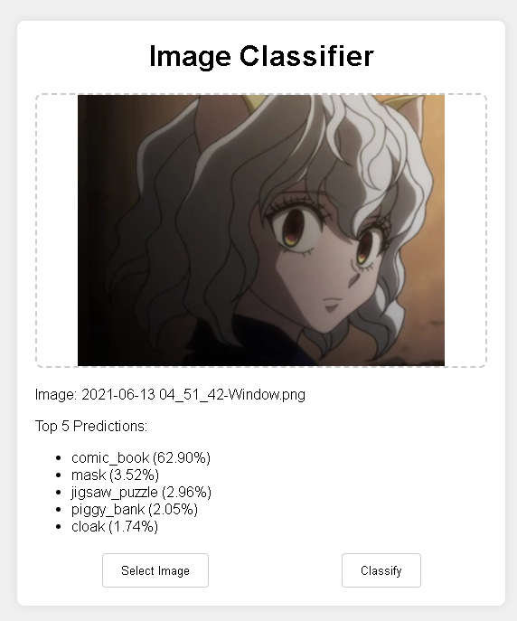

# CogniPixel: A Computer Vision Exploration

Welcome to **CogniPixel**, a curated collection of applications and tools designed to explore the fascinating world of computer vision. This repository serves as a hands-on learning journal, documenting the journey from basic concepts to more advanced implementations.

---

## Projects Collection

1.  **[Image Classifier (Flask)](#1-image-classifier-flask)**: A web-based tool for classifying images using a pre-trained deep learning model.

---

## 1. Image Classifier (Flask)

A simple, self-contained web application that allows users to upload an image and receive a classification of its content based on the MobileNetV2 model.

### Demo

Here are some examples of the classifier in action:

| Input Image | Classification Result |
| :---: | :---: |
|  |  |

### Prerequisites

Before you begin, ensure you have the following installed on your system:

- **Python 3.9+**: The programming language used to run the backend server. You can download it from [python.org](https://www.python.org/downloads/).
- **Git**: The version control system used to clone the repository. You can download it from [git-scm.com](https://git-scm.com/downloads).

### How to Run

#### Option A: One-Click Start (for Windows Users)

1.  Navigate into the `CogniPixel/ImageClassifier_Flask` directory.
2.  Simply **double-click the `start.bat` file**.
3.  A command prompt window will appear, automatically install the necessary libraries, and then launch the application. A browser tab will open automatically.

#### Option B: Manual Start (for macOS, Linux, and Advanced Users)

1.  **Clone the Repository**: First, get the entire `CogniPixel` project collection on your local machine.
    ```bash
    git clone https://github.com/YourUsername/CogniPixel.git
    ```
    *(Remember to replace `YourUsername` with your actual GitHub username)*

2.  **Navigate to Project Directory**: Move into the specific folder for this tool.
    ```bash
    cd CogniPixel/ImageClassifier_Flask
    ```

3.  **Install Dependencies**: Set up a virtual environment (optional but recommended) and install the required Python packages.
    ```bash
    # Create and activate a virtual environment (optional)
    python -m venv venv
    # On Windows
    .\venv\Scripts\activate
    # On macOS/Linux
    # source venv/bin/activate

    # Install packages
    pip install -r requirements.txt
    ```

4.  **Run the Application**: Execute the Python script to start the backend server. It will automatically open the web interface in your default browser.
    ```bash
    python app.py
    ```

### Educational Significance & AI Limitations

This tool is not just a utility; it's a practical lesson in how modern AI applications are built and the inherent limitations they possess.

#### Key Learning Points:

*   **Full-Stack Interaction**: It demonstrates a complete workflow between a user-facing **frontend** (the HTML/JS/CSS webpage) and a powerful **backend** (the Python/Flask server).
*   **API Communication**: You can observe how JavaScript uses the `fetch` API to send data (the image) to a specific endpoint (`/classify`) and asynchronously receive a structured response (the JSON results).
*   **Power of Pre-trained Models**: We are leveraging **MobileNetV2**, a massive model trained by Google on millions of images. This project shows how you can integrate state-of-the-art AI into your own applications without the immense cost and time of training from scratch.

#### Understanding AI's Boundaries

An intelligent machine is not an all-knowing one. The following examples illustrate the boundaries of our AI model:

**1. Lack of Specific / Proper Noun Knowledge**

The model is trained to recognize general categories, not specific, branded, or named entities.

*   **Example**: When given an image of a famous dinosaur character from a cookie box, the AI will not recognize it as "the cookie dinosaur."
*   **AI's View**: It will correctly identify the general shape and classify it as a `tyrannosaurus_rex` or a similar generic term. It has no concept of brands, characters, or popular culture.

| Input: A specific character | AI's Interpretation: A generic object |
| :---: | :---: |
|  | `Prediction: tyrannosaurus_rex` |

**2. The Domain Gap: Real World vs. Stylized Art**

The model was primarily trained on real-world photographs. It struggles when presented with art styles that deviate significantly from reality.

*   **Example**: When shown a close-up of an anime character's face, the model may fail to provide a confident or accurate classification.
*   **AI's View**: It might identify abstract features like `hair`, `face`, or `person`, but it lacks the context to understand the artistic style. It may misinterpret large anime eyes or stylized hair, leading to strange predictions. It certainly won't know the character's name.

| Input: Stylized anime art | AI's Interpretation: A confused guess based on real-world objects |
| :---: | :---: |
|  | `Prediction: wig, mask, or other visual similarities` |

By understanding these limitations, we learn to be better engineers: we learn to choose the right model for the right task and to be critical of the results AI produces.
